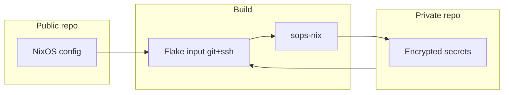

# SSH and secrets

Strategy for SSH key management and secrets with a public NixOS/dotfiles repo and a handful of servers.

## Chosen approach: A (current)

- **Repo:** Public only. No keys or tokens in the repo ([AGENTS.md](../AGENTS.md)).
- **SSH keys:** One key per purpose (e.g. `id_ed25519_github`, `id_ed25519_servers`, `id_ed25519_forgejo`). Configure `~/.ssh/config` with `IdentityFile` and `IdentitiesOnly yes` per host. Keys live outside the repo.
- **Server authorized_keys:** Not managed by Nix. Push public keys via `scp` and append to `~/.ssh/authorized_keys` on each server. See [server-quickstart.md](../server-quickstart.md) and comments in [nixos/hosts/sunken-ship.nix](../nixos/hosts/sunken-ship.nix).

Benefits: no private repo, simple, works with public dotfiles. Trade-off: one-time (or scripted) scp step per server; authorized_keys are not declarative in Nix.

## Optional future: private secrets repo + sops-nix

If you later want declarative secrets (passwords, tokens) or authorized_keys in Nix, a common pattern is:

- **Public repo:** Config only (like this one).
- **Private repo:** Encrypted secret files (e.g. `secrets.yaml`), added as a flake input via `git+ssh://...`.
- **sops-nix:** Decrypts at activation using age (e.g. host SSH key). Secrets end up in `/run/secrets/`; you can reference them in config (e.g. `hashedPasswordFile`, or `openssh.authorizedKeys.keyFiles` for authorized_keys).

References: [sops-nix](https://github.com/Mic92/sops-nix), NixOS options `users.users.<name>.openssh.authorizedKeys.keyFiles` and `sops.secrets`.

## Long-term plan

1. **Now:** Use approach A. Document and follow one key per purpose and scp-based server keys; see AGENTS.md and server-quickstart.md.
2. **Optional later:** If you add a private secrets repo, add it as a flake input, enable sops-nix with a small module (defaultSopsFile from that input, age with host SSH key). Use for hashedPassword and service secrets first.
3. **Optional later:** To make authorized_keys declarative, add an encrypted file (one key per line) in the private repo and set `users.users.<name>.openssh.authorizedKeys.keyFiles = [ config.sops.secrets.authorized_keys.path ];` in the server host module.

AGENTS.md remains the source of truth for key naming and one-key-per-purpose.
